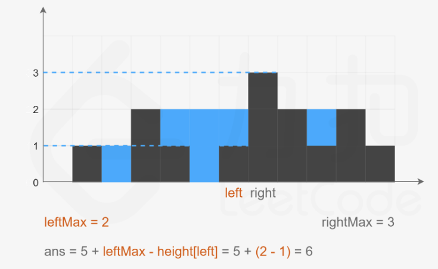

# LeetCode 日志

## 《Hot 100》

### 哈希表

[1. 两数之和](https://leetcode.cn/problems/two-sum/)

**思路**

遍历的时候使用哈希表记录之前的值和位置，下一步直接查找key中是否存在target - nums[i]这个值，存在则取出target - nums[i]的位置，返回结果。

**代码**

```java
// key: num[i]位置上的值，value：num[i]位置
class Solution {
  
    public int[] twoSum(int[] nums, int target) {
        HashMap<Integer, Integer> map = new HashMap<>();
        for (int i = 0; i < nums.length; i++) {
            if (map.containsKey(target - nums[i])) {
                return new int[]{map.get(target - nums[i]), i};
            } else {
                map.put(nums[i], i);
            }
        }
        return new int[]{};
    }
  
}
```

**复杂度**

- 时间复杂度: O(N)
- 空间复杂度: O(N)


[49. 字母异位词分组](https://leetcode.cn/problems/group-anagrams/)

**思路**

使用哈希表，将异位词转变成一个相同的key，value是每一个key对应的异位词列表。

**方法一：排序**

**代码**

```Java []

class Solution {

    // 方法一：对每一个字符串排序
    public List<List<String>> groupAnagrams(String[] strs) {
        HashMap<String, List<String>> map = new HashMap<>();
        for (String str : strs) {
            char[] chars = str.toCharArray();
            Arrays.sort(chars);
            // 错误：String key = chars.toString();
            String key = new String(chars); // !API
            List<String> list = map.getOrDefault(key, new ArrayList<String>());
            list.add(str);
            map.put(key, list);
        }
        return new ArrayList<List<String>>(map.values());
    }
  
}
```
**复杂度**

- 时间复杂度: O(N * Mlog(M))
- 空间复杂度: O(N * M)

**方法二：计数**

**代码**

```Java []

class Solution {
    public List<List<String>> groupAnagrams(String[] strs) {

        // 方法二：对每一个字符串的字符进行计数
        HashMap<String, List<String>> map = new HashMap<>();
        for (String str : strs) {
            // 记录每个字符出现的次数
            int[] counts = new int[26]; 
            int len = str.length();
            for (int i = 0; i < len; i++) {
                counts[str.charAt(i) - 'a']++;
            }
            StringBuilder sb = new StringBuilder();
            // 将"abca"转换为”a2b1“作为唯一的 key
            for (int i = 0; i < 26; i++) {
                // 判断是否存在这个字符
                if (counts[i] != 0) {
                    sb.append((char)('a' + i));
                    sb.append(counts[i]);
                }
            }
            String key = sb.toString();
            List<String> list = map.getOrDefault(key, new ArrayList<String>()); // !API
            list.add(str);
            map.put(key, list);
        }
        return new ArrayList<List<String>>(map.values()); // !API
    }
  
}
```

**复杂度**

- 时间复杂度: O(N * M)
- 空间复杂度: O(N * M)

### 集合

[128. 最长连续序列](https://leetcode.cn/problems/longest-consecutive-sequence/)

**思路**

使用集合进行去重，然后从第一个元素开始累加 1，直至不连续跳出循环，更新最大值。

**代码**

```Java []

class Solution {
  
    public int longestConsecutive(int[] nums) {
        int maxLen = 0;
        HashSet<Integer> set = new HashSet<>();
        for (int num : nums) {
            set.add(num);
        }
        for (int num : set) {
            // 如果当前值是连续序列的起点，则继续计数
            if (!set.contains(num - 1)) {
                int curLen = 1;
                while (set.contains(++num)) {
                    curLen++;
                }
                maxLen = Math.max(maxLen, curLen);
            }
        }
        return maxLen;
    }
  
}
```

**复杂度**

- 时间复杂度：O(N)
- 空间复杂度：O(N)

### 双指针

[283. 移动零](https://leetcode.cn/problems/move-zeroes/description/)

**思路**

左指针指向已经处理好的序列的尾部的后一个元素，右指针指向待处理序列的头部，遍历一遍交换即可即可。

**代码**

```Java []

class Solution {
  
    public void moveZeroes(int[] nums) {
        int left = 0; // 左指针指向已经处理好的序列的尾部的后一个元素
        int right = 0; // 右指针指向待处理序列的头部
        while (right < nums.length) {
            if (nums[right] != 0) {
                swap(nums, left, right);
                left++;
            }
            right++;
        }
    }

    private void swap(int[] nums, int left, int right) {
        int tmp = nums[left];
        nums[left] = nums[right];
        nums[right] = tmp;
    }
  
}
```

**复杂度**

- 时间复杂度: O(N)
- 空间复杂度: O(1)


[11. 盛最多水的容器](https://leetcode.cn/problems/container-with-most-water/description/)

**思路**

水的容积取决于短板，双指针进行循环收窄。


这里使用了双指针进行循环收窄的过程，每次选定两板中的短板，向内收窄一格。


**代码**

```Java []

class Solution {
  
    public int maxArea(int[] height) {
        int left = 0;
        int right = height.length - 1;
        int max = 0;
        while (left < right) {
            max = height[left] < height[right] ?
                Math.max(max, (right - left) * height[left++]):
                Math.max(max, (right - left) * height[right--]);
        }
        return max;
    }
  
}
```

**复杂度**

- 时间复杂度: O(N)
- 空间复杂度: O(1)


[15. 三数之和](https://leetcode.cn/problems/3sum/description/)

**思路**

三指针遍历


使用三个指针对数组逐个遍历，注意去重的几种情况：

1. i > 0 && ((nums[i] == nums[i - 1]))

2. 在找到一组和为 0 的数据后，继续去重：
    
    - nums[right] == nums[right - 1]
    
    - nums[left] == nums[left + 1]

**Code**

```Java []
class Solution {
  
    public List<List<Integer>> threeSum(int[] nums) {
        List<List<Integer>> res = new ArrayList<>();
        Arrays.sort(nums);
        for (int i = 0; i < nums.length; i++) {
            if (nums[i] > 0) {
                return res;
            }
            // i 要和之前的元素比较去重
            if (i > 0 && (nums[i] == nums[i - 1])) {
                continue;
            }
            int left = i + 1;
            int right = nums.length - 1;
            while (left < right) {
                int sum = nums[i] + nums[left] + nums[right];
                if (sum < 0) {
                    left++;
                } else if (sum > 0) {
                    right--;
                } else {
                    res.add(Arrays.asList(nums[i], nums[left], nums[right])); // !API
                    while ((left < right) && (nums[right] == nums[right - 1])) {
                        right--;
                    }
                    while ((left < right) && (nums[left] == nums[left + 1])) {
                        left++;
                    }
                    right--;
                    left++;
                }
            }
        }
        return res;
    }
  
}
```

**复杂度**

- 时间复杂度: O(N^2)
- 空间复杂度: O(N)


[42. 接雨水](https://leetcode.cn/problems/trapping-rain-water/description/)

**思路**

对于每个位置，计算它左侧最大值和右侧最大值中的较小值，然后减去当前位置的高度。这个值表示当前位置能够积累的雨水量（每个桶的容量）。



**代码**

```Java []

class Solution {

    public int trap(int[] height) {
        int res = 0;
        int left = 0;
        int right = height.length - 1;
        int leftMax = 0;
        int rightMax = 0;
        while (left <= right) {
            leftMax = Math.max(leftMax, height[left]);
            rightMax = Math.max(rightMax, height[right]);
            res += leftMax < rightMax ? 
                leftMax - height[left++] : rightMax - height[right--];
        }
        return res;
    }

}
```

**复杂度**

- 时间复杂度: O(N)
- 空间复杂度: O(1)

### 滑动窗口

[3. 无重复字符的最长子串](https://leetcode.cn/problems/longest-substring-without-repeating-characters/description/)

**思路**

哈希表记录该字符最近一次出现的位置，left，i为不重复的左右窗口边界，每次遍历都更新一次最大值。

**代码**

```Java []
class Solution {
  
    public int lengthOfLongestSubstring(String s) {
        if ((s == null) || (s.length() == 0)) {
            return 0;
        }
        HashMap<Character, Integer> map = new HashMap<>();
        int max = 0;
        int left = 0; // left是滑动窗口的左边，i是右边
        // map 中已经有了该字符键就更新 left 的值，不包含就更新 i 和 max 的值
        for (int i = 0; i < s.length(); i++) {
            if (map.containsKey(s.charAt(i))) {
                left = Math.max(left, map.get(s.charAt(i)) + 1);
            } 
            map.put(s.charAt(i), i); 
            max = Math.max(max, i - left + 1);
        }
        return max;
    }
  
}
```

**复杂度**

- 时间复杂度: O(N)
- 空间复杂度: O(N)


[438. 找到字符串中所有字母异位词](https://leetcode.cn/problems/find-all-anagrams-in-a-string/description/)

**思路**

通过两个数组int[26]记录每次滑动窗口内的字符数量是否相等，相等则为字母异位词。注意第一组数据的处理。

在每个循环迭代中，首先更新 sCount 数组，这是通过以下步骤完成的：

1. 减少窗口左侧字符的频次：sCount[s.charAt(i) - 'a']--。因为窗口的左侧将不再包含在滑动窗口内，所以对应字符的频次需要减少。
2. 增加窗口右侧字符的频次：sCount[s.charAt(i + pLen) - 'a']++。新加入窗口的字符需要增加频次。

随后，代码检查更新后的 sCount 是否与 pCount 相等，如果相等，说明窗口内的字符频次与字符串 p 的字符频次相同，也就是窗口内的子串是 p 的字母异位词。此时，将当前窗口的起始索引 i + 1 加入到结果列表中。

**代码**

```Java []

class Solution {
  
    public List<Integer> findAnagrams(String s, String p) {
        int sLen = s.length();
        int pLen = p.length();

        if (sLen < pLen) {
            return new ArrayList<Integer>();
        }

        ArrayList<Integer> res = new ArrayList<Integer>();
        int[] sCount = new int[26];
        int[] pCount = new int[26];

        for (int i = 0; i < pLen; i++) {
            sCount[s.charAt(i) - 'a']++;
            pCount[p.charAt(i) - 'a']++;
        }

        if (Arrays.equals(sCount, pCount)) {
            res.add(0);
        }

        for (int i = 0; i < sLen - pLen; i++) {
            sCount[s.charAt(i) - 'a']--;
            sCount[s.charAt(i + pLen) - 'a']++; // 右窗口移动

            if (Arrays.equals(sCount, pCount)) {
                res.add(i + 1);
            }
        }
        return res;
    }
  
}
```

**复杂度**

- 时间复杂度: O(M + N)
- 空间复杂度: O(1)

### 字串

[560. 和为 K 的子数组](https://leetcode.cn/problems/subarray-sum-equals-k/description/)

**思路**

pre[i] − pre[j − 1] == k => pre[j − 1] == pre[i] − k

**代码**

```Java []
class Solution {
  
    // pre[i] − pre[j − 1] == k —> pre[j − 1] == pre[i] − k
    public int subarraySum(int[] nums, int k) {
        int count = 0;
        int pre = 0;
        HashMap<Integer, Integer> map = new HashMap<>(); // 记录前缀和的数量
        map.put(0, 1); // !初始化
        for (int num : nums) {
            pre += num;
            if (map.containsKey(pre - k)) {
                count += map.get(pre - k);
            }
            map.put(pre, map.getOrDefault(pre, 0) + 1);
        }
        return count;
    }
  
}
```

复杂度

- 时间复杂度: O(N)
- 空间复杂度: O(N)


[239. 滑动窗口最大值](https://leetcode.cn/problems/sliding-window-maximum/description/)

**思路**

使用固定容量的单调队列收集每一个滑动窗口的最大值。


**代码**

```Java []
// 单调队列
class Solution {
  
    public int[] maxSlidingWindow(int[] nums, int k) {
        int n = nums.length;
        int[] res = new int[n - k + 1];
        Deque<Integer> deque = new LinkedList<>();
        for (int i = 0; i < n; i++) {
            // 添加元素时，如果要添加的元素大于队尾处的元素，就将队尾元素弹出
            while (!deque.isEmpty() && (nums[i] >= nums[deque.peekLast()])) {
                deque.pollLast();
            }
            deque.offerLast(i);
            // 如果队首存储的角标就是滑动窗口左边界数值，就移除队首
            if (!deque.isEmpty() && ((i - k) == deque.peekFirst())) {
                deque.pollFirst();
            }
            // 当i增长到第一个窗口右边界时，每滑动一步都将队首角标对应的元素放入到结果数组
            if (i >= k - 1) {
                res[i - k + 1] = nums[deque.peekFirst()];
            }
        }
        return res;
    }
  
}

```

**复杂度**

- 时间复杂度: O(N)
- 空间复杂度: O(N)


```Java []
// 使用优先队列（大根堆）
class Solution {
  
    public int[] maxSlidingWindow(int[] nums, int k) {
        int n = nums.length;
        // 设定优先队列的排序顺序：
        // 如果 pair1 和 pair2 的第一个元素不相等 (pair1[0] != pair2[0])，则按照第一个元素降序排列，即 pair2[0] - pair1[0]。
        // 如果 pair1 和 pair2 的第一个元素相等，则按照第二个元素降序排列，即 pair2[1] - pair1[1]，保证稳定性。
        PriorityQueue<int[]> priorityQueue = new PriorityQueue<>(
            (pair1, pair2) -> pair1[0] != pair2[0] ? pair2[0] - pair1[0] : pair2[1] - pair1[1]);
        for (int i = 0; i < k; i++) {
            priorityQueue.offer(new int[]{nums[i], i});
        }
        int[] res = new int[n - k + 1];
        res[0] = priorityQueue.peek()[0];
        for (int i = k; i < n; i++) {
            // 保持窗口大小，移除超出窗口范围的元素
            priorityQueue.offer(new int[]{nums[i], i});
            while (priorityQueue.peek()[1] <= i - k) {
                priorityQueue.poll();
            }
            res[i - k + 1] = priorityQueue.peek()[0];
        }
        return res;
    }
  
}
```


[76. 最小覆盖子串](https://leetcode.cn/problems/minimum-window-substring/description/)

**思路**

使用滑动窗口双指针遍历字符串，使用count标识当次遍历中还需要几个字符才能够满足包含t中所有字符的条件。

步骤一：不断增加j使滑动窗口增大，直到窗口包含了T的所有元素。

步骤二：不断增加i使滑动窗口缩小，因为是要求最小字串，所以将不必要的元素排除在外，使长度减小，直到碰到一个必须包含的元素，这个时候不能再扔了，再扔就不满足条件了，记录此时滑动窗口的长度，并保存最小值。

步骤三：让i再增加一个位置，这个时候滑动窗口肯定不满足条件了，那么继续从步骤一开始执行，寻找新的满足条件的滑动窗口，如此反复，直到j超出了字符串S范围。


**代码**

```Java []
class Solution {
  
    public String minWindow(String s, String t) {
        if (s == null || s.length() == 0 || t == null || t.length() == 0) {
            return "";
        }
        int[] need = new int[128];
        for (int i = 0; i < t.length(); i++) {
            need[t.charAt(i)]++;
        }
        int l = 0, r = 0, size = Integer.MAX_VALUE, count = t.length(), start = 0;
        while (r < s.length()) {
            char c = s.charAt(r);
            if (need[c] > 0) {
                count--;
            }
            need[c]--;
            // count == 0说明当前的窗口已经满足了包含t所需所有字符的条件
            if (count == 0) {
                // 如果左边界这个字符对应的值在need[]数组中小于0，说明他是一个多余元素，不包含在t内
                while (l < r && need[s.charAt(l)] < 0) {
                    need[s.charAt(l)]++;
                    l++; // 左边界向右移，过滤掉这个元素
                }
                // 如果当前的这个窗口值比之前维护的窗口值更小，需要进行更新
                if (r - l + 1 < size) {
                    size = r - l + 1;
                    start = l;
                }
                need[s.charAt(l)]++; // 先将l位置的字符计数重新加1
                // 重新维护左边界值和当前所需字符的值count 
                l++;
                count++;
            }
            r++;
        }
        return size == Integer.MAX_VALUE ? "" : s.substring(start, start + size); // !API
    }
  
}
```

**复杂度**

- 时间复杂度: O(N)
- 空间复杂度: O(1)


## 《剑指offer》

## 《代码随想录》

## 《编程之美》

## 《计算之魂》

## 《持续练习》

